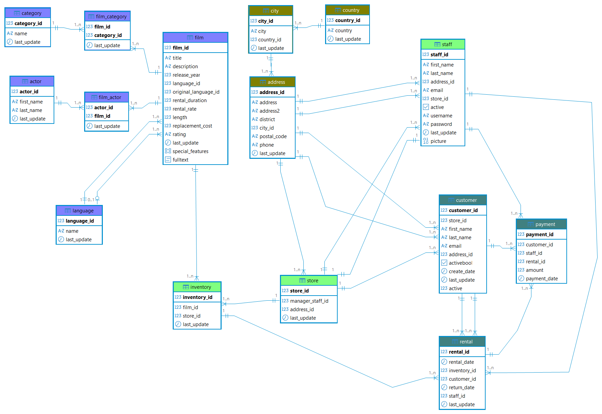

# 🎬 Proyecto SQL — Base de Datos Sakila

Análisis completo de la base de datos **Sakila** (tienda de alquiler de películas) usando PostgreSQL. El proyecto cubre desde la creación del esquema y carga de datos hasta consultas avanzadas con joins, subconsultas, CTEs y funciones de agregación.

---

## 🗂️ Esquema de la Base de Datos

El diagrama está organizado por colores para facilitar su lectura:

| Color | Área | Tablas |
|-------|------|--------|
| 🟣 Morado | Películas | `film`, `actor`, `category`, `language`, `film_actor`, `film_category` |
| 🟤 Marrón | Localización | `country`, `city`, `address` |
| 🟢 Verde | Tienda y logística | `store`, `staff`, `inventory` |
| 🔵 Azul | Ventas y alquileres | `customer`, `rental`, `payment` |

---

## 🛠️ Pasos seguidos en el proyecto

### 1. Carga de datos
Se utilizó el archivo `BBDD_Proyecto_shakila_sinuser.sql`, un script de inicialización que crea el esquema `shakila`, define la estructura de las 15 tablas e incluye toda la carga de datos necesaria para que la base de datos sea funcional.

### 2. Creación del esquema y tablas
Se creó el esquema `shakila` usando `search_path` para evitar escribir el nombre del esquema en cada consulta. Las 15 tablas se crearon con sus claves primarias (PK) y las claves foráneas (FK) se añadieron con `ALTER TABLE`, usando `ON UPDATE CASCADE` y `ON DELETE RESTRICT` para mantener la integridad referencial.

### 3. Vistas, CTEs y Tablas temporales

- **Vistas:** Se creó `view_film_category` para unir películas y géneros sin repetir joins en múltiples consultas.
- **CTEs (`WITH`):** Usadas para segmentar consultas complejas y demostrar su uso práctico.
- **Tablas temporales:** Aplicadas para guardar datos intermedios como el total de alquileres por cliente, mejorando el rendimiento.

---

## 🧠 Técnicas SQL utilizadas

**Filtrado y selección**
`WHERE`, `=`, `>`, `<`, `BETWEEN`, `AND`, `OR`, `IN`, `NOT IN`, `IS NULL`, `IS NOT NULL`, `ILIKE`

**Funciones de agregación**
`COUNT`, `SUM`, `AVG`, `MAX`, `MIN`, `STDDEV`, `VARIANCE`, `ROUND`

**Agrupación**
`GROUP BY`, `HAVING`

**Unión de tablas**
`INNER JOIN`, `LEFT JOIN`, `RIGHT JOIN`, `CROSS JOIN`

**Subconsultas**
Anidadas en `WHERE` y `HAVING` para comparar registros contra valores calculados. Uso de `DISTINCT` para eliminar duplicados.

**Ordenación y paginación**
`ORDER BY`, `LIMIT`, `OFFSET`

**Fechas y tiempo**
`DATE()`, `EXTRACT`, `INTERVAL`

**Otros**
`AS` para alias, `CONCAT()` para unir campos, `ILIKE` para búsquedas sin distinción de mayúsculas

---

## 📊 Informe del análisis

- El catálogo contiene **1.000 películas**, todas estrenadas en 2006 y en idioma inglés.
- La duración varía desde **46 minutos** hasta más de **3 horas**.
- La columna `original_language_id` de la tabla `film` contiene únicamente valores nulos, por lo que no es posible conocer el idioma original real.
- El tiempo máximo de alquiler permitido (`rental_duration`) es de **7 días**.
- Los **musicales** son la categoría menos alquilada de la base de datos.
- A través de las relaciones entre tablas es posible identificar: las películas más y menos alquiladas, los clientes que más ingresos generan, los actores con más participaciones y el stock disponible por tienda.
- Las tablas de localización (`address`, `city`, `country`) podrían usarse para identificar zonas con mayor demanda y orientar decisiones de negocio como apertura de nuevas tiendas o campañas promocionales.

---

## 📁 Archivos del repositorio

| Archivo | Descripción |
|---------|-------------|
| `ProyectoSQL_Logica_Consultas.sql` | Todas las consultas resueltas, con número, enunciado y comentarios explicando la lógica aplicada |
| `BBDD_Proyecto_shakila_sinuser.sql` | Script de carga completa de la base de datos |
| `shakila_esquema_realacion_entidad.png` | Imagen del esquema entidad-relación |

---

## 🔗 Repositorio del curso

[github.com/AdamTR93/MASTER_thePower_Data_Analytics](https://github.com/AdamTR93/MASTER_thePower_Data_Analytics)
